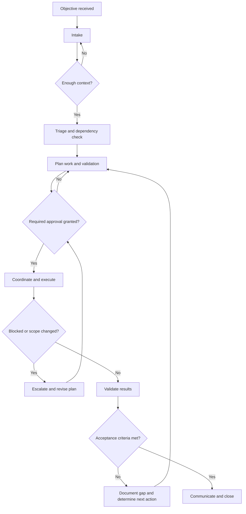

# Command Center Workflow

## Purpose

The Command Center turns an approved objective into coordinated, traceable work. It provides a shared path for intake, planning, execution, validation, and closure while keeping decisions and responsibilities visible.

This workflow is provider-neutral: teams may use any compatible ticketing, communication, automation, or monitoring tools.

## Major components

- **Intake:** Capture the objective, scope, constraints, urgency, stakeholders, and definition of success.
- **Triage:** Confirm ownership, assess impact and risk, identify dependencies, and decide whether the request is ready to plan.
- **Planning and approval:** Break the objective into ordered tasks, name responsible roles, define validation, and obtain required approval before execution.
- **Coordination:** Maintain the shared status, route decisions, manage handoffs, and escalate blockers.
- **Execution:** Perform only approved work within the stated scope and record material outcomes.
- **Validation:** Check the result against the acceptance criteria and document evidence, limitations, and unresolved issues.
- **Closure and learning:** Communicate the outcome, preserve the operational record, and capture useful follow-up actions.

## End-to-end flow

The approval gate depends on a sufficiently detailed intake, completed triage, and a reviewable plan. Execution depends on approval. Closure depends on validation evidence and clear communication of the final state.

## Workflow steps

### 1. Intake the objective

The requester or intake owner records what outcome is needed, why it matters, who is affected, applicable constraints, urgency, and known risks. Ambiguous or missing information is resolved before the request moves forward.

**Output:** A shared objective with scope, constraints, stakeholders, and measurable success conditions.

### 2. Triage scope, impact, and dependencies

The Command Center lead confirms priority and ownership with the relevant subject-matter experts. The team identifies prerequisites, downstream effects, security or compliance concerns, and any other active work that could conflict.

Requests that are unsafe, out of scope, or not yet actionable return to intake with a clear explanation.

**Output:** A readiness decision, assigned owner, risk level, and dependency list.

### 3. Build and approve the plan

The work owner creates the smallest practical sequence of tasks. Each task identifies its expected result, dependencies, responsible role, validation method, and any decision or approval gate. Reviewers confirm that the plan matches the objective and operational constraints.

Execution begins only after the required approver records approval. If scope, risk, or assumptions materially change later, the work pauses and returns to this step.

**Output:** An approved, traceable implementation and validation plan.

### 4. Coordinate and execute

The work owner carries out the approved tasks in dependency order. The coordinator keeps status current, makes handoffs explicit, and ensures that decisions, blockers, and deviations are visible to affected roles.

Routine implementation details may be resolved by the assigned owner. Changes to approved scope, risk, or success criteria require escalation and, when appropriate, renewed approval.

**Output:** Completed work plus an operational record of key actions, decisions, and exceptions.

### 5. Validate the outcome

The validator checks the result using the plan's acceptance criteria and records evidence. Validation should cover the intended outcome, relevant failure paths, operational impact, and known limitations. The validator should be independent of the implementation when risk or policy requires it.

If criteria are not met, the team documents the gap and returns to planning rather than silently broadening the work.

**Output:** A pass/fail result with supporting evidence and any residual risks.

### 6. Communicate and close

The coordinator communicates the outcome to stakeholders in plain language, including what changed, validation status, remaining limitations, and required follow-up. The record is closed only after ownership of any remaining action is explicit.

The team captures reusable lessons when they would improve future intake, planning, execution, or validation.

**Output:** A closed record, stakeholder notification, and owned follow-up items.

## Roles and responsibilities

One person may hold multiple roles for low-risk work, but accountability should remain explicit.

| Role | Primary responsibilities |
| --- | --- |
| Requester | States the desired outcome, supplies context, and confirms business intent. |
| Intake owner | Ensures the request is understandable, complete enough to triage, and visible in the shared record. |
| Command Center lead | Sets priority, assigns accountable ownership, resolves coordination conflicts, and leads escalation. |
| Work owner | Produces the plan, executes approved work, maintains status, and reports deviations or blockers. |
| Subject-matter expert | Advises on feasibility, dependencies, operational impact, and domain-specific risk. |
| Approver | Confirms that scope, risk, controls, and validation are acceptable before gated work begins or resumes. |
| Validator | Evaluates the result against acceptance criteria and records objective evidence. |
| Communications owner | Tailors timely updates to stakeholders and ensures the final state is understood. |

## Coordination and escalation

- Use one shared record as the source of truth for status, ownership, decisions, approvals, and evidence.
- Give every dependency and follow-up item an owner and a visible state.
- Escalate when safety, security, compliance, customer impact, timing, or approved scope may be affected.
- Pause at the nearest safe point when required authority or information is missing.
- Record why a plan changed and which roles accepted the change.
- Keep stakeholder updates proportional to impact and urgency.

## Acceptance criteria for this workflow documentation

The document is acceptable when:

- A reader can identify the workflow's purpose, entry point, approval gate, validation gate, and completion point.
- Major components and their dependencies are complete enough to guide normal operations.
- Roles have clear accountability without assuming a particular team structure or tool provider.
- The flowchart and written steps agree and make loops, gates, and escalation paths easy to follow.
- Language is direct and understandable to both operational and technical participants.
- Teams can adapt implementation details while preserving scope control, traceability, validation, and communication.

## Documentation quality assurance checklist

Before publishing or materially revising this document, confirm that:

- [ ] The described process matches current operational practice.
- [ ] Intake, triage, planning, approval, execution, validation, escalation, and closure are covered.
- [ ] Step order, prerequisites, handoffs, decision gates, and feedback loops are consistent.
- [ ] Every responsibility belongs to a named role, with no important ownership gaps.
- [ ] The visual flow matches the written workflow and remains readable when rendered.
- [ ] Acceptance criteria test clarity, completeness, usability, and technical accuracy.
- [ ] Terms are defined by context and unnecessary jargon has been removed.
- [ ] Sentences use simple, direct language and avoid ambiguous instructions.
- [ ] Examples and instructions do not depend on a specific provider, product, or vendor.
- [ ] Security, compliance, and operational claims have been checked by suitable experts where relevant.
- [ ] Links, references, and formatting render correctly in the intended documentation system.
- [ ] A reader unfamiliar with the process can identify what to do, who owns it, and what happens next.
