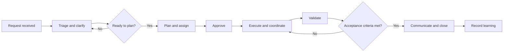

# Command Center workflow

The Command Center turns a request into a verified outcome while keeping decisions, ownership, and status visible. This workflow is provider-neutral: teams may use any suitable ticketing, communication, automation, or observability tools.

## Workflow at a glance

## Roles and responsibilities

One person may fill more than one role, but ownership should remain explicit.

| Role | Responsibility |
| --- | --- |
| Requester | States the desired outcome, supplies context, and confirms that the result meets the need. |
| Command Center lead | Owns triage, priority, coordination, status, escalation, and closure. |
| Subject-matter owner | Clarifies requirements, constraints, dependencies, and operational impact. |
| Implementer | Performs the approved work, records material decisions, and reports blockers or scope changes. |
| Reviewer or validator | Independently checks the outcome and supporting evidence against the acceptance criteria. |
| Stakeholders | Provide required decisions and receive updates appropriate to impact and urgency. |

For routine, low-risk work, the lead may also implement or validate. Higher-risk work should preserve independent approval and validation where operational policy requires it.

## Workflow

### 1. Receive and record the request

Capture the requester, desired outcome, business or operational context, urgency, affected systems or users, known constraints, and a reliable communication channel. Create a single source of truth for status and decisions.

**Output:** A traceable request with an initial owner.

### 2. Triage and clarify

The Command Center lead and subject-matter owner confirm scope, impact, priority, risks, dependencies, required access, and whether another active effort overlaps. They identify missing information and agree on observable acceptance criteria before planning.

Urgent response may begin with containment, but assumptions and follow-up actions must still be recorded.

**Depends on:** A recorded request.

**Output:** A clear, prioritized, actionable problem statement.

### 3. Plan and assign

Break the work into the smallest safe sequence. For each activity, name an owner, prerequisites, expected evidence, communication points, and rollback or recovery considerations when relevant. Call out decisions that require stakeholder or policy approval.

**Depends on:** Clarified scope and acceptance criteria.

**Output:** An executable plan with explicit ownership and dependencies.

### 4. Approve

The appropriate decision-maker confirms that the plan, risk, scope, and acceptance criteria are acceptable. Approval must be recorded before work that requires authorization begins. If the scope materially changes later, pause the affected work and obtain a new decision.

**Depends on:** A complete plan and identified approver.

**Output:** A recorded approval, rejection, or request for revision.

### 5. Execute and coordinate

Implementers perform only the approved work, update the shared status, and attach useful evidence. The lead coordinates handoffs, resolves scheduling conflicts, keeps stakeholders informed, and escalates blockers or unexpected risk. Parallel activities may proceed only when their dependencies and ownership are clear.

**Depends on:** Required approval and available prerequisites.

**Output:** A completed change or operational action with an activity record.

### 6. Validate

The validator compares the outcome and evidence with the acceptance criteria. Validation should cover intended behavior, important failure paths, operational readiness, and unintended impact in proportion to risk. Failed checks return to execution with a clearly described gap.

**Depends on:** Completed execution and accessible evidence.

**Output:** A pass/fail decision with supporting evidence.

### 7. Communicate and close

The lead summarizes what happened, current state, validation result, known limitations, follow-up owners, and any user action required. The requester or designated owner confirms acceptance when needed. Close the request only after unresolved work is separately tracked and owned.

**Depends on:** Successful validation or an explicitly accepted exception.

**Output:** A communicated, accepted outcome and a complete record.

### 8. Record learning

For recurring, high-impact, or unexpectedly difficult work, capture reusable lessons. Update runbooks, templates, monitoring, or training material when the learning changes future operations.

**Depends on:** Closure information and observed results.

**Output:** Actionable follow-up or an explicit decision that none is needed.

## Acceptance criteria for this workflow

The documentation is ready for use when:

- A reader can identify the workflow entry point, decision points, feedback loops, and closure condition.
- Every stage states its purpose, dependency, and expected output.
- Ownership is explicit without assuming a particular team structure or service provider.
- Approval, escalation, validation, and communication responsibilities are distinguishable.
- The diagram and text agree, and the document can still be understood if the diagram is not rendered.
- Language is concise enough for routine use while covering both normal work and meaningful exceptions.
- Technical claims match the organization's current operational policies and controls.

## Documentation quality assurance

Before publishing or materially revising this document, confirm:

- [ ] Major workflow components and operational handoffs are present.
- [ ] Steps appear in a logical order, with dependencies and feedback loops explained.
- [ ] Roles reflect actual authority, accountability, and staffing practices.
- [ ] The visual aid matches the written workflow and has clear text labels.
- [ ] Acceptance criteria emphasize clarity, completeness, usability, and technical accuracy.
- [ ] Language is plain, concise, inclusive, and free of unexplained jargon.
- [ ] Examples and instructions do not require a specific vendor or provider.
- [ ] Links, role names, controls, and policy references are current.
- [ ] Accessibility is considered, including meaningful headings and a text equivalent for the diagram.
- [ ] A person unfamiliar with the process has reviewed the document for usability.
